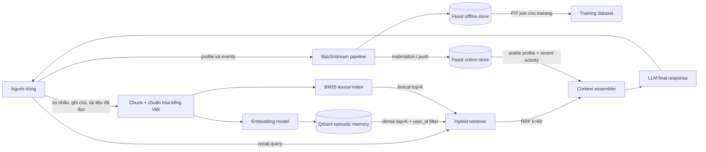

# Hybrid Memory cho trợ lý AI cá nhân Việt Nam

**Contributor:** fubao1tuoi — VinUniversity AICB A20-K4  
**Phạm vi:** POC chạy cục bộ, không gọi LLM trả phí; `recall()` tạo context sẵn sàng đưa vào LLM.

## Sơ đồ kiến trúc

Luồng này cố ý tách câu hỏi “điều gì có liên quan?” khỏi câu hỏi “người dùng này là ai?”. Qdrant trả lời câu thứ nhất bằng ký ức phi cấu trúc; Feast trả lời câu thứ hai bằng các đặc trưng có schema và thời gian hiệu lực rõ ràng. Hai nguồn chỉ gặp nhau tại `Context assembler`, sau khi truy xuất đã áp dụng `user_id` isolation.

## Quyết định 1 — Chunking episodic memory

POC chọn **semantic-lite chunking theo ranh giới câu**, giới hạn khoảng 450 ký tự và lặp lại 80 ký tự cuối giữa hai chunk. So với lưu mỗi message nguyên vẹn, chunk nhỏ giúp một cuộc hội thoại dài không làm embedding bị “trung bình hóa” giữa nhiều chủ đề; query về Kubernetes không phải kéo theo cả đoạn nói về OAuth. So với chunk cố định từng 100 token, ranh giới câu giữ ý tiếng Việt tự nhiên hơn và giảm các mảnh vô nghĩa. Phần overlap cải thiện recall khi một ý nằm qua biên, nhưng đổi lại tăng số vector, dung lượng lưu trữ và khả năng trả về các kết quả gần trùng nhau.

Không chọn chunk cực nhỏ theo từng câu đơn lẻ vì retrieval tuy chính xác cục bộ nhưng context mất quan hệ nguyên nhân–kết quả. Cũng không chọn semantic segmentation bằng LLM trong POC: chất lượng có thể tốt hơn, nhưng mỗi lần `remember()` sẽ phát sinh chi phí, latency và phụ thuộc API. Trong production, tôi sẽ đo Recall@K trên ký ức được gán nhãn trước khi đổi chiến lược, thay vì mặc định tin rằng chunk càng “thông minh” càng tốt.

Với tiếng Việt, whitespace split không tương đương word segmentation vì “điện toán đám mây” gồm nhiều âm tiết. Dense embedding xử lý được phần lớn vấn đề, còn BM25 trong POC giữ token kỹ thuật như `Kubernetes`, `OAuth`, `JWT`. Production nên thử `underthesea` hoặc `pyvi`, đồng thời chuẩn hóa lỗi Telex chưa chuyển dấu (`khong`, `ddam may`) và code-switching như “deploy service lên cloud”. Tuy nhiên phải A/B test vì tokenizer tiếng Việt đôi khi tách sai tên sản phẩm hoặc source code.

## Quyết định 2 — Feature schema

Stable profile dùng entity `user_id` với `preferred_language`, `reading_speed_wpm`, `topic_affinity`; recent activity dùng `queries_last_hour` và `distinct_topics_24h`. Tôi chọn **feature dạng bảng, diễn giải được** thay vì một vector “user preference” duy nhất. Tabular features dễ kiểm tra, có TTL riêng, dùng được cho rule, ranking và audit; embedding profile có thể nắm sở thích tiềm ẩn tốt hơn nhưng khó giải thích vì sao hệ thống kết luận người dùng thích một chủ đề, khó xóa chọn lọc và dễ drift khi đổi embedding model.

TTL phản ánh ngữ nghĩa, không dùng một giá trị chung: profile ngôn ngữ/tốc độ đọc có TTL 30 ngày; popularity của nội dung có TTL 24 giờ; query velocity có TTL 1 giờ. Training dùng Feast `get_historical_features()` để PIT join, tránh lấy profile tương lai cho một hành vi quá khứ. Serving dùng cùng tên feature từ online store, giảm training-serving skew.

Một phương án bị bác bỏ rõ ràng là **lưu toàn bộ episodic memory như embedding feature trong Feast**. Feast phù hợp với feature có schema và chu kỳ materialize; ký ức mới đến liên tục, cần full-text/vector retrieval, xóa từng item và re-index theo embedding version. Ép hai vòng đời vào một store làm deployment, retention và quyền xóa dữ liệu phức tạp hơn. Vì vậy Qdrant giữ episodic memory, Feast giữ profile; liên kết chỉ qua `user_id`.

## Quyết định 3 — Freshness strategy

Không có một SLA freshness đúng cho mọi dữ liệu. Tôi chọn ba tầng:

1. **Sub-second:** `remember()` ghi trực tiếp Qdrant ngay sau khi user lưu ghi chú hoặc đọc xong tài liệu. Query “tôi vừa đọc gì?” phải thấy ký ức mới lập tức. Đổi lại, synchronous write làm request chậm hơn và cần retry/idempotency.
2. **Khoảng 5 phút hoặc streaming micro-batch:** `queries_last_hour`, topic đang quan tâm và tín hiệu phiên. Đây là cân bằng giữa độ mới và chi phí; chậm vài phút chấp nhận được cho recommendation nhưng không nên đợi batch ngày hôm sau.
3. **Hàng ngày:** `topic_affinity`, `reading_speed_wpm` và preference ổn định. Cập nhật tức thời sẽ khiến profile dao động theo một phiên bất thường; daily aggregation ổn định hơn và rẻ hơn.

Khi event streaming thất bại, context vẫn hoạt động với episodic memory và profile cũ, nhưng phải gắn `feature_timestamp`/freshness để LLM không diễn giải số liệu cũ như hiện tại. Materialization cần quan sát lag và cảnh báo theo từng feature view.

## Retrieval, bảo mật và ghép context

Mỗi query chạy dense retrieval và BM25 rồi hợp nhất bằng RRF `1/(60 + rank)`. Dense xử lý paraphrase tiếng Việt; lexical giữ chính xác acronym và tên công nghệ. Qdrant dùng collection chung để tránh tạo hàng triệu collection nhỏ, nhưng **mọi dense query bắt buộc có payload filter `user_id`**. Demo còn chèn một bí mật của `u_999` để kiểm tra nó không xuất hiện khi `u_001` recall. Trong production, filter metadata chỉ là isolation mềm: cần authorization trước retrieval, encryption at rest, audit log và test cross-tenant tự động. Dữ liệu cá nhân phải có mục đích xử lý, thời hạn giữ và cơ chế xóa phù hợp Nghị định 13/2023/NĐ-CP.

Context cuối gồm stable profile, recent activity và top-3 episodic memories. Giới hạn top-3 giữ context window nhỏ, nhưng có thể bỏ sót bằng chứng; production có thể retrieve top-20 rồi rerank, deduplicate và áp memory decay. LLM chỉ được nhận context sau bước policy filtering, không được tự quyết định bỏ `user_id` filter.

## Những gì POC chưa xử lý

POC dùng Qdrant in-memory nên mất dữ liệu khi process dừng; BM25 được dựng lại lúc recall; chưa có update/delete memory, deduplication, encryption, consent UI, multi-device sync hay migration khi đổi embedding model. Nó chưa chuẩn hóa Telex, chưa chống prompt injection nằm trong memory, chưa đo relevance trên golden set thật và chưa tóm tắt/consolidate ký ức cũ. Feast profile phụ thuộc NB4 đã materialize; nếu chưa có, agent degrade về `unknown` thay vì thất bại. Production cần persistent Qdrant, version trường `embedding_model`, outbox/idempotency cho dual writes, cache có namespace + TTL, và bài test red-team riêng cho rò rỉ tenant.

## Vibe-coding workflow log

Prompt hiệu quả nhất là prompt nêu rõ interface, schema payload, ràng buộc không API key và tiêu chí “demo phải exit 0”; nó giúp AI sinh boilerplate Qdrant/Feast nhanh mà vẫn kiểm thử được. Prompt kém hiệu quả là “xây AI memory tốt nhất”, vì không định nghĩa freshness, tenant isolation hay metric nên dễ tạo kiến trúc nhiều thành phần nhưng không chứng minh được tradeoff. Các quyết định chunk size, TTL, RRF budget và privacy boundary được review thủ công theo bài học NB5–NB8.
